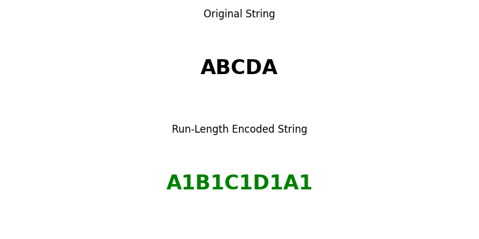

# 5. Run-Length Encoding (RLE) (Lossless)


##  What is RLE?
- Run-Length Encoding is a simple lossless compression technique that replaces consecutive repeated values with a single value and a count.


### Example

Original String: “ABCDA”


###  Python Code

```python

import matplotlib.pyplot as plt

def run_length_encoding(s):
    encoding = []
    count = 1

    for i in range(1, len(s) + 1):
        if i < len(s) and s[i] == s[i - 1]:
            count += 1
        else:
            encoding.append((s[i - 1], count))
            count = 1
    return encoding

# Input string
original_string = "ABCDA"

# Encode the string
encoded = run_length_encoding(original_string)

# Prepare encoded string representation
encoded_str = ''.join([f"{char}{count}" for char, count in encoded])

# Plotting
fig, axs = plt.subplots(2, 1, figsize=(8, 4))

# Original string plot
axs[0].text(0.5, 0.5, original_string, fontsize=24, ha='center', va='center', fontweight='bold')
axs[0].set_title("Original String")
axs[0].axis('off')

# Encoded string plot
axs[1].text(0.5, 0.5, encoded_str, fontsize=24, ha='center', va='center', fontweight='bold', color='green')
axs[1].set_title("Run-Length Encoded String")
axs[1].axis('off')

plt.tight_layout()
plt.show()

```


###  MATLAB Code

```matlab

% Input string
originalString = 'ABCDA';

% Run-length encoding function
function encoded = runLengthEncoding(s)
    count = 1;
    encoded = {};
    idx = 1;
    for i = 2:length(s)+1
        if i <= length(s) && s(i) == s(i-1)
            count = count + 1;
        else
            encoded{idx} = [s(i-1), num2str(count)];
            idx = idx + 1;
            count = 1;
        end
    end
end

% Encode the string
encodedCells = runLengthEncoding(originalString);
encodedStr = strjoin(encodedCells, '');

% Plotting
figure;

% Original string subplot
subplot(2,1,1);
text(0.5, 0.5, originalString, 'FontSize', 24, 'FontWeight', 'bold', 'HorizontalAlignment', 'center');
title('Original String');
axis off;

% Encoded string subplot
subplot(2,1,2);
text(0.5, 0.5, encodedStr, 'FontSize', 24, 'FontWeight', 'bold', 'Color', 'g', 'HorizontalAlignment', 'center');
title('Run-Length Encoded String');
axis off;

```




