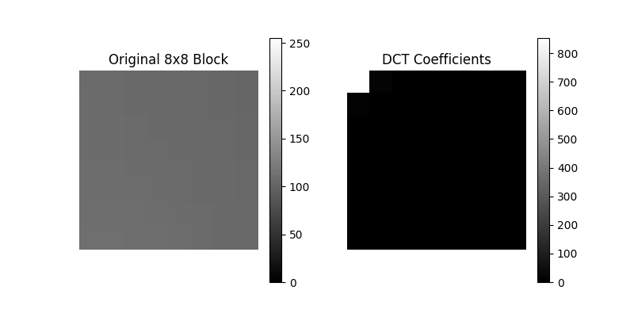

# 6. DCT & JPEG Compression (Lossy)


##  What is DCT?

- The Discrete Cosine Transform (DCT) transforms a signal or image from the spatial domain to the frequency domain. It is the foundation of JPEG image compression.


### JPEG Compression Steps:


1. Convert image to YCbCr and split into 8x8 blocks.
2. Apply DCT to each block.
3. Quantize the DCT coefficients.
4. Apply zigzag scanning.
5. Use RLE and Huffman coding.
6. Store the compressed bitstream.


###  DCT Equation (2D)
\[
F(u,v) = \frac{1}{4} C(u)C(v) \sum_{x=0}^{7} \sum_{y=0}^{7} f(x,y) \cos\left( \frac{(2x+1)u\pi}{16} \right) \cos\left( \frac{(2y+1)v\pi}{16} \right)
\]

---

###  Python Code 

```python

# Import the OpenCV library for image processing
import cv2
import numpy as np
from scipy.fftpack import dct, idct
import matplotlib.pyplot as plt
# Import the function to get the image path
from file_handler import get_image_path  

# Get the image path using the provided function
path = get_image_path()
# Read image in grayscale
img = cv2.imread(path, 0)

# Resize the image to 256x256
img = cv2.resize(img, (256, 256))

# Extract the first 8x8 block of the image
block = img[0:8, 0:8]

# Apply DCT to the block (first on columns, then on rows)
dct_block = dct(dct(block.T, norm='ortho').T, norm='ortho')

# Print the DCT block result
print("DCT Block:\n", dct_block)

# Plot the original block and the DCT coefficients
plt.figure(figsize=(8,4))

plt.subplot(1,2,1)
plt.title("Original 8x8 Block")
plt.imshow(block, cmap='gray', vmin=0, vmax=255)
plt.colorbar()
plt.axis('off')

plt.subplot(1,2,2)
plt.title("DCT Coefficients")
plt.imshow(np.abs(dct_block), cmap='gray')
plt.colorbar()
plt.axis('off')

plt.show()

```


###  MATLAB Code

```matlab
% Read image in grayscale
img = imread('path');
if size(img,3) == 3
    img = rgb2gray(img);
end

% Resize the image to 256x256
img = imresize(img, [256 256]);

% Extract the first 8x8 block
block = double(img(1:8, 1:8));

% Apply 2D DCT to the block
dct_block = dct2(block);

% Display the original block and DCT coefficients
figure;

subplot(1,2,1);
imshow(uint8(block));
title('Original 8x8 Block');
colorbar;

subplot(1,2,2);
imshow(abs(dct_block), []);
title('DCT Coefficients');
colorbar;

```




