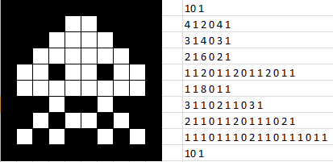
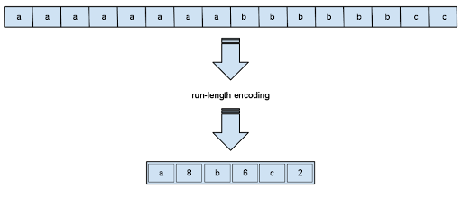

# 5. Run-Length Encoding (RLE) (Lossless)


## 📘 What is RLE?
Run-Length Encoding is a simple lossless compression technique that replaces consecutive repeated values with a single value and a count.

* Example



---

## Example
Input: AAAAAAAABBBBBBCC 
Output: (A,8), (B,6), (C,2)


## 🐍 Python Code
```python
ddef rle_encode(data):
    encoding = []  # Initialize an empty list to store the encoding
    prev_char = data[0]  # Store the first character
    count = 1  # Initialize the count to 1 for the first character
    for char in data[1:]:  # Iterate through the remaining characters in the data
        if char == prev_char:
            count += 1  # If the current character is the same as the previous one, increment the count
        else:
            encoding.append((prev_char, count))  # If different, append the previous character and its count to the encoding list
            prev_char = char  # Update the previous character
            count = 1  # Reset the count to 1 for the new character
    encoding.append((prev_char, count))  # Append the last character and its count to the encoding list
    return encoding

data = " AAAAAAAABBBBBBC "  # Example input string to encode
print(rle_encode(data))  # Print the encoded output

```

---

## 🧠 MATLAB Code
```matlab
data = 'AAAAAAAABBBBBBCC ';  % Input data string
encoded = [];  % Initialize an empty array for the encoded output
count = 1;  % Initialize count to 1 for the first character

% Loop through the string starting from the second character
for i = 2:length(data)
    if data(i) == data(i-1)  % If the current character is the same as the previous one
        count = count + 1;  % Increment the count
    else
        encoded = [encoded; data(i-1), count];  % Add the previous character and its count to the encoded array
        count = 1;  % Reset count for the new character
    end
end
encoded = [encoded; data(end), count];  % Add the last character and its count
disp(encoded);  % Display the result

```

---




---


