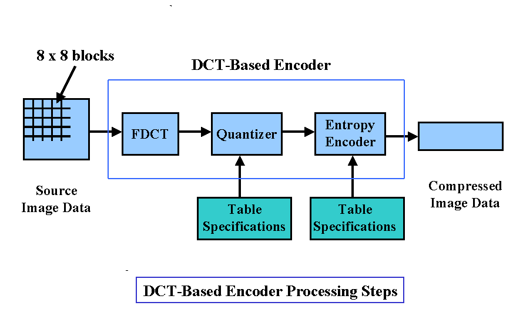
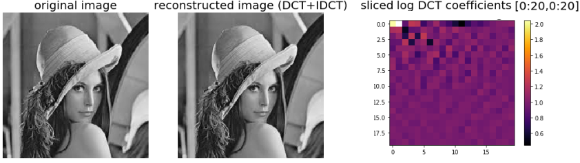

# 6. DCT & JPEG Compression (Lossy)


##  What is DCT?

The Discrete Cosine Transform (DCT) transforms a signal or image from the spatial domain to the frequency domain. It is the foundation of JPEG image compression.

---

## JPEG Compression Steps:



1. Convert image to YCbCr and split into 8x8 blocks.
2. Apply DCT to each block.
3. Quantize the DCT coefficients.
4. Apply zigzag scanning.
5. Use RLE and Huffman coding.
6. Store the compressed bitstream.


---

## 📐 DCT Equation (2D)
\[
F(u,v) = \frac{1}{4} C(u)C(v) \sum_{x=0}^{7} \sum_{y=0}^{7} f(x,y) \cos\left( \frac{(2x+1)u\pi}{16} \right) \cos\left( \frac{(2y+1)v\pi}{16} \right)
\]

---

## 🐍 Python (OpenCV + SciPy)
```python
import cv2
import numpy as np
from scipy.fftpack import dct, idct

# Read image in grayscale
img = cv2.imread('image.jpg', 0)

# Resize the image to 256x256
img = cv2.resize(img, (256, 256))

# Extract the first 8x8 block of the image
block = img[0:8, 0:8]

# Apply DCT to the block (first on columns, then on rows)
dct_block = dct(dct(block.T, norm='ortho').T, norm='ortho')

# Print the DCT block result
print("DCT Block:\n", dct_block)

```

---

## 🧠 MATLAB Code
```matlab
% Read the image
img = imread('image.jpg'); 

% Convert the image to grayscale
gray = rgb2gray(img); 

% Extract the first 8x8 block and convert to double
block = double(gray(1:8, 1:8)); 

% Apply 2D DCT
D = dct2(block); 

% Display the DCT result
disp(D);

```

---




---

