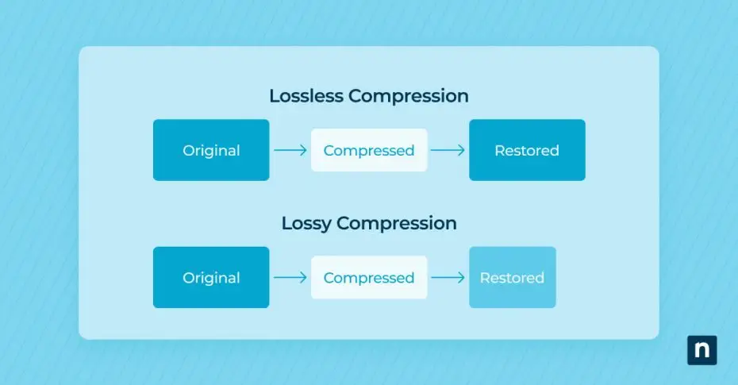

# 7. Comparison of Compression Techniques

| Technique      | Type      | Lossless | Redundancy Target       | Efficiency | Use Case             |
| -------------- | --------- | -------- | ----------------------- | ---------- | -------------------- |
| Huffman Coding | Entropy   | ✅        | Coding Redundancy       | High       | Text, Images         |
| RLE            | Simple    | ✅        | Interpixel Redundancy   | Medium     | Images with patterns |
| DCT + JPEG     | Transform | ❌        | Psychovisual Redundancy | Very High  | Natural Images       |

---

## 📘 Summary
- **Lossless** methods like Huffman and RLE preserve exact data.
- **Lossy** methods like JPEG (DCT) achieve higher compression by removing perceptually unimportant data.
- The choice depends on application needs: quality vs. compression ratio.

  

---

