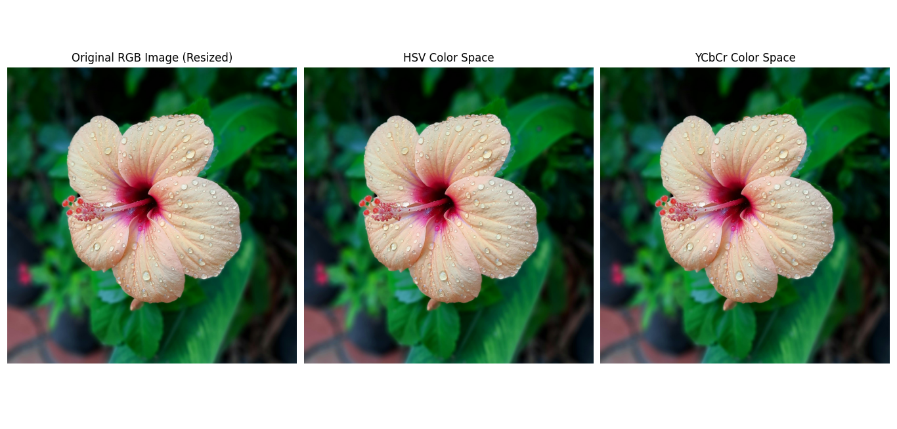

# 7.2 Color Transformation


##  Introduction

- Transformation alters color appearance for enhancement, filtering, or correction.

## General Formula:

\[
g(x,y) = T[f(x,y)]
\]

---

### Python Code

```python

import cv2  # Import OpenCV for image processing
import numpy as np  # Import NumPy for numerical operations
import matplotlib.pyplot as plt  # Import Matplotlib for plotting

# Load image using OpenCV
img = cv2.imread('sampel.jpg')  # Load the image (replace with your image path)

if img is None:
    print("Error: Image not found or failed to load.")
else:
    # Resize image for faster processing
    resized = cv2.resize(img, (img.shape[1] // 2, img.shape[0] // 2))

    # Convert BGR to RGB for correct display in Matplotlib
    img_rgb = cv2.cvtColor(resized, cv2.COLOR_BGR2RGB)

    # Convert BGR to HSV color space
    img_hsv = cv2.cvtColor(resized, cv2.COLOR_BGR2HSV)
    # Convert BGR to YCbCr color space
    img_ycbcr = cv2.cvtColor(resized, cv2.COLOR_BGR2YCrCb)

    # Convert HSV back to RGB for visualization
    img_hsv_rgb = cv2.cvtColor(img_hsv, cv2.COLOR_HSV2RGB)
    # Convert YCbCr to BGR then to RGB for visualization
    img_ycbcr_rgb = cv2.cvtColor(cv2.cvtColor(img_ycbcr, cv2.COLOR_YCrCb2BGR), cv2.COLOR_BGR2RGB)

    # Convert resized image to grayscale for edge detection
    gray = cv2.cvtColor(resized, cv2.COLOR_BGR2GRAY)

    # Apply Canny edge detection
    edges = cv2.Canny(gray, 100, 200)

    # Plot original and converted images
    plt.figure(figsize=(18, 6))

    # Display original RGB image
    plt.subplot(1, 3, 1)
    plt.imshow(img_rgb)
    plt.title('Original RGB Image (Resized)')
    plt.axis('off')

    # Display HSV color space image
    plt.subplot(1, 3, 2)
    plt.imshow(img_hsv_rgb)
    plt.title('HSV Color Space')
    plt.axis('off')

    # Display YCbCr color space image
    plt.subplot(1, 3, 3)
    plt.imshow(img_ycbcr_rgb)
    plt.title('YCbCr Color Space')
    plt.axis('off')

    plt.tight_layout()
    plt.show()

```


###  MATLAB Code

```matlab

% Read the input image
img = imread('sampel.jpg');  % Load the image (replace with your image path)

if isempty(img)
    disp('Error: Image not found or failed to load.');
else
    % Resize the image for faster processing
    resized = imresize(img, 0.5);  % Scale down by 50%

    % Convert BGR to RGB (MATLAB loads images as RGB by default, so skip)
    img_rgb = resized;  % MATLAB default is RGB

    % Convert RGB to HSV color space
    img_hsv = rgb2hsv(img_rgb);

    % Convert RGB to YCbCr color space
    img_ycbcr = rgb2ycbcr(img_rgb);

    % Convert HSV to RGB for visualization
    img_hsv_rgb = hsv2rgb(img_hsv);

    % YCbCr is already in a displayable format, use directly
    img_ycbcr_rgb = img_ycbcr;  

    % Convert resized image to grayscale for edge detection
    gray = rgb2gray(resized);

    % Apply Canny edge detection
    edges = edge(gray, 'Canny', [0.1 0.2]);  % Thresholds scaled [0,1]

    % Display original RGB image
    figure;
    subplot(1,3,1);
    imshow(img_rgb);
    title('Original RGB Image (Resized)');

    % Display HSV color space image (converted back to RGB)
    subplot(1,3,2);
    imshow(img_hsv_rgb);
    title('HSV Color Space');

    % Display YCbCr color space image
    subplot(1,3,3);
    imshow(img_ycbcr_rgb);
    title('YCbCr Color Space');
end

```


###  Image




