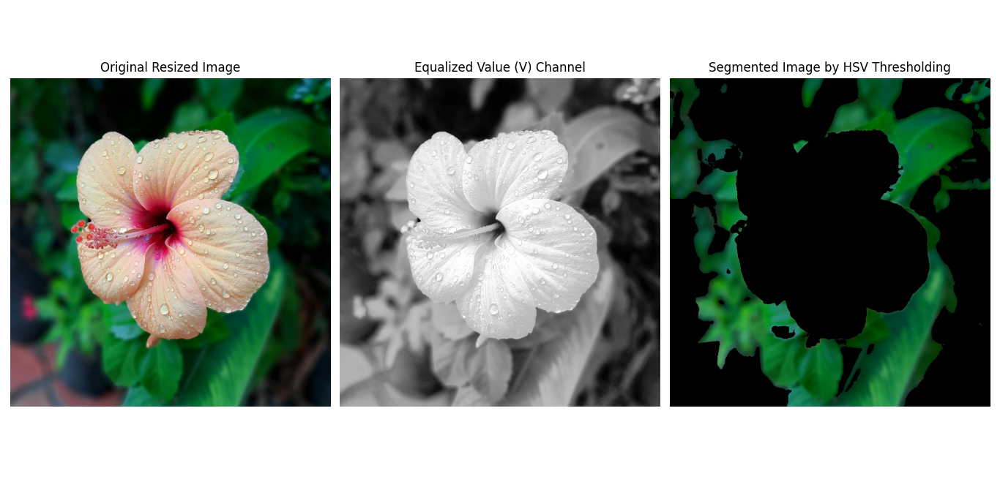

# 7.4 Color Segmentation

<video width="800" height="410" controls>
    <source src="photows/FundamentalsofColoImageProcessing.mp4" type="video/mp4">
    Your browser does not support the video tag.
  </video>

---

##  Introduction
- Segmentation based on color similarity (e.g., HSV thresholding).


##  HSV Thresholding

### Condition:

\[
H_{min} \leq H \leq H_{max}, S_{min} \leq S \leq S_{max}, V_{min} \leq V \leq V_{max}
\]

---

###  Python Code

```python
# Import OpenCV for image processing
import cv2
# Import NumPy for numerical computations
import numpy as np
# Import Matplotlib for image visualization
import matplotlib.pyplot as plt

# Load the image from file
img = cv2.imread('sample.jpg')  # Load 'sample.jpg' image

# Check if image is loaded correctly
if img is None:
    raise FileNotFoundError("Image not found. Please check the file path.")

# Resize image to half for easier processing and visualization
resized = cv2.resize(img, (img.shape[1] // 2, img.shape[0] // 2))

# Convert BGR to HSV color space
hsv = cv2.cvtColor(resized, cv2.COLOR_BGR2HSV)

# Split HSV channels
h, s, v = cv2.split(hsv)

# Apply histogram equalization on the V channel to enhance brightness/contrast
v_eq = cv2.equalizeHist(v)

# Merge channels back with equalized V
hsv_eq = cv2.merge([h, s, v_eq])

# Define HSV thresholds for target color (example: green)
# Hue range in OpenCV is [0,179], so scale accordingly
hue_min, hue_max = 35, 85    # approx green
sat_min = 100                # saturation threshold
val_min = 75                 # value threshold

# Create mask based on thresholds
mask = cv2.inRange(hsv_eq, (hue_min, sat_min, val_min), (hue_max, 255, 255))

# Apply mask to original resized image
segmented = cv2.bitwise_and(resized, resized, mask=mask)

# Convert images to RGB for matplotlib display
resized_rgb = cv2.cvtColor(resized, cv2.COLOR_BGR2RGB)
segmented_rgb = cv2.cvtColor(segmented, cv2.COLOR_BGR2RGB)
v_eq_rgb = cv2.cvtColor(cv2.merge([v_eq, v_eq, v_eq]), cv2.COLOR_BGR2RGB)  # grayscale V channel as RGB

# Plot original resized, equalized V channel, and segmented images side by side
plt.figure(figsize=(15, 5))

plt.subplot(1, 3, 1)
plt.imshow(resized_rgb)
plt.title('Original Resized Image')
plt.axis('off')

plt.subplot(1, 3, 2)
plt.imshow(v_eq, cmap='gray')
plt.title('Equalized Value (V) Channel')
plt.axis('off')

plt.subplot(1, 3, 3)
plt.imshow(segmented_rgb)
plt.title('Segmented Image by HSV Thresholding')
plt.axis('off')

plt.tight_layout()
plt.show()


```


###  MATLAB Code

```matlab

% Read input image
img = imread('image.jpg'); % Replace with your image path

% Resize image for processing
img_resized = imresize(img, 0.5);

% Convert RGB to HSV
hsv_img = rgb2hsv(img_resized);

% Extract HSV channels
H = hsv_img(:, :, 1); % Hue [0,1]
S = hsv_img(:, :, 2); % Saturation [0,1]
V = hsv_img(:, :, 3); % Value [0,1]

% Enhance Value channel with histogram equalization
V_eq = histeq(V);

% Recombine HSV with equalized Value
hsv_eq = cat(3, H, S, V_eq);

% Define HSV thresholds for target color (example: detect green)
% Hue range for green approx 0.25 to 0.45 (scaled 0-1)
hue_min = 0.25;  
hue_max = 0.45;

% Saturation and Value thresholds to avoid low intensity/noisy pixels
sat_min = 0.4;  
val_min = 0.3;

% Create binary mask based on HSV thresholds
mask = (H >= hue_min) & (H <= hue_max) & (S >= sat_min) & (V_eq >= val_min);

% Apply mask to original resized image
segmented_img = bsxfun(@times, img_resized, cast(mask, 'like', img_resized));

% Display results
figure;

subplot(2, 2, 1);
imshow(img_resized);
title('Original Resized Image');

subplot(2, 2, 2);
imshow(V);
title('Original Value Channel');

subplot(2, 2, 3);
imshow(V_eq);
title('Equalized Value Channel');

subplot(2, 2, 4);
imshow(segmented_img);
title('Segmented Image by HSV Thresholding');

```
###  Image
