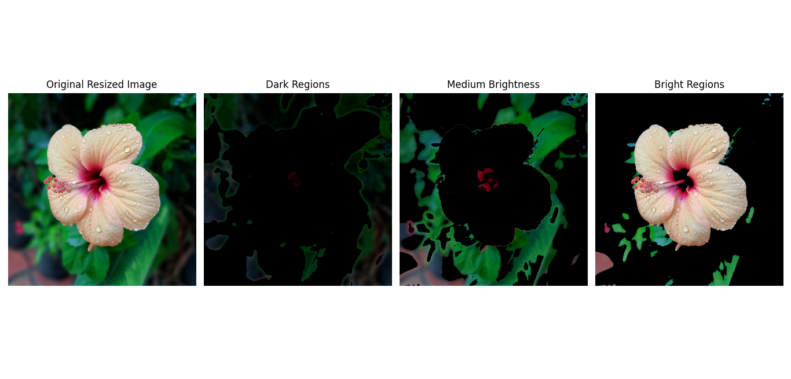

# 7.5 Intensity Slicing


## Overview

- Pseudo-color image processing enhances grayscale images by mapping intensities to colors to make subtle changes more visible.

## Intensity Slicing

- Intensity slicing partitions grayscale values into intervals and maps them to specific colors.

## Mathematical equation:

 - For a grayscale image `f(x, y)`:

\[
f(x, y) = c_k if f(x, y) ∈ v_k
\]

 - Where `c_k` is the color assigned to the interval `v_k` of intensities.

---

##  Python Code 

```python

# Import OpenCV for image processing
import cv2
# Import NumPy for numerical computations
import numpy as np
# Import Matplotlib for image visualization
import matplotlib.pyplot as plt

# Load the image from file
img = cv2.imread('sample.jpg')  # Load 'sample.jpg' image

# Check if image is loaded correctly
if img is None:
    raise FileNotFoundError("Image not found. Please check the file path.")

# Resize the image to half of its original dimensions
resized = cv2.resize(img, (img.shape[1] // 2, img.shape[0] // 2))

# Convert image from BGR to YCbCr color space
ycbcr = cv2.cvtColor(resized, cv2.COLOR_BGR2YCrCb)

# Split the YCbCr image into individual channels
y, cr, cb = cv2.split(ycbcr)

# Enhance the brightness and contrast by equalizing the Y (luminance) channel
y_eq = cv2.equalizeHist(y)

# Define brightness ranges for intensity slicing on the equalized Y channel
intensity_slices = {
    'Dark Regions': (0, 85),           # Low intensity
    'Medium Brightness': (86, 170),   # Medium intensity
    'Bright Regions': (171, 255)      # High intensity
}

# Prepare a matplotlib figure with multiple subplots
plt.figure(figsize=(15, 5))

# Convert the original resized image to RGB for proper visualization using matplotlib
resized_rgb = cv2.cvtColor(resized, cv2.COLOR_BGR2RGB)

# Display the original resized image
plt.subplot(1, len(intensity_slices) + 1, 1)
plt.imshow(resized_rgb)
plt.title('Original Resized Image')
plt.axis('off')

# Loop through each brightness range and display the masked result
for i, (label, (low, high)) in enumerate(intensity_slices.items(), start=2):
    # Create a binary mask for the current intensity range using inRange
    mask = cv2.inRange(y_eq, low, high)

    # Apply the mask to the original resized image to highlight specific brightness regions
    sliced_img = cv2.bitwise_and(resized, resized, mask=mask)

    # Convert the result to RGB for visualization
    sliced_rgb = cv2.cvtColor(sliced_img, cv2.COLOR_BGR2RGB)

    # Show the segmented region in a subplot
    plt.subplot(1, len(intensity_slices) + 1, i)
    plt.imshow(sliced_rgb)
    plt.title(label)
    plt.axis('off')

# Adjust layout to prevent overlap and display all plots
plt.tight_layout()
plt.show()

```


##  MATLAB Code

```matlab

% Read the image from file
img = imread('sample.jpg'); % Load 'sample.jpg' image

% Resize the image to half of its original dimensions
resized = imresize(img, 0.5);

% Convert RGB image to YCbCr color space
ycbcr = rgb2ycbcr(resized);

% Split the YCbCr image into Y, Cb, Cr channels
y = ycbcr(:,:,1);
cb = ycbcr(:,:,2);
cr = ycbcr(:,:,3);

% Enhance brightness and contrast by equalizing the Y channel
y_eq = histeq(y);

% Define brightness ranges for intensity slicing
intensity_slices = {...
    'Dark Regions', [0 85]; ...
    'Medium Brightness', [86 170]; ...
    'Bright Regions', [171 255]};

% Prepare figure for displaying results
figure;
subplot(1, length(intensity_slices)+1, 1);
imshow(resized);
title('Original Resized Image');

% Loop through each intensity range and display masked image
for i = 1:size(intensity_slices, 1)
    label = intensity_slices{i, 1};
    range = intensity_slices{i, 2};
    
    % Create a binary mask for pixels within the range on the equalized Y channel
    mask = (y_eq >= range(1)) & (y_eq <= range(2));
    
    % Apply the mask to each RGB channel
    segmented = zeros(size(resized), 'like', resized);
    for c = 1:3
        channel = resized(:,:,c);
        channel(~mask) = 0; % Zero out pixels outside the mask
        segmented(:,:,c) = channel;
    end
    
    % Display the segmented image
    subplot(1, length(intensity_slices)+1, i+1);
    imshow(segmented);
    title(label);
end

```

###  Image




