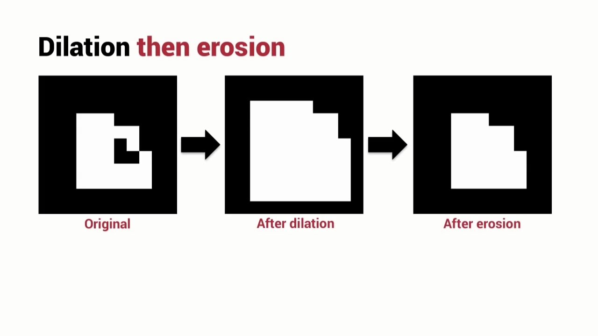
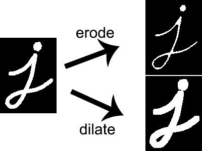

# 8.0 intro Image Segmentation

<video  src="photo/ImageSegmentation.mp4" width="800" height="410" controls>
    Your browser does not support the video tag.
  </video>

---

## 8.1 Dilation & Erosion

### 🧠 Overview

Morphological operations that modify the structure of objects in binary and grayscale images.

- **Dilation (التوسيع)**: Expands the white regions (foreground).
- **Erosion (التآكل)**: Shrinks the white regions.

These operations depend on a small probe called a **structuring element**.



---

## 📐 Mathematical Definitions

- **Dilation**:  
  \( A \oplus B = \{ z \mid (B)_z \cap A \neq \emptyset \} \)

- **Erosion**:  
  \( A \ominus B = \{ z \mid (B)_z \subseteq A \} \)

Where:
- \( A \): image set
- \( B \): structuring element
- \( (B)_z \): translation of B to position z

---

## 🧪 OpenCV Code

```python
import cv2
import numpy as np

# Load binary image (0 to read in grayscale)
img = cv2.imread('binary_image.png', 0)

# Define a 5x5 kernel of ones
kernel = np.ones((5,5), np.uint8)

# Dilation: Expands white regions (foreground), useful to fill gaps or connect components
dilated = cv2.dilate(img, kernel, iterations = 1)

# Erosion: Shrinks white regions (foreground), useful to remove small noise
eroded = cv2.erode(img, kernel, iterations = 1)

# Display original and processed images
cv2.imshow("Original", img)
cv2.imshow("Dilated", dilated)
cv2.imshow("Eroded", eroded)
cv2.waitKey(0)
cv2.destroyAllWindows()

```
### 💻 MATLAB Code
```matlab
% Load binary image
img = imread('binary_image.png');

% Create a structuring element (disk shape with radius 5)
se = strel('disk', 5);

% Apply Dilation: expands white regions (foreground)
dilated = imdilate(img, se);

% Apply Erosion: shrinks white regions (foreground)
eroded = imerode(img, se);

% Display original and processed images
subplot(1,3,1), imshow(img), title('Original');
subplot(1,3,2), imshow(dilated), title('Dilated');
subplot(1,3,3), imshow(eroded), title('Eroded');

```

