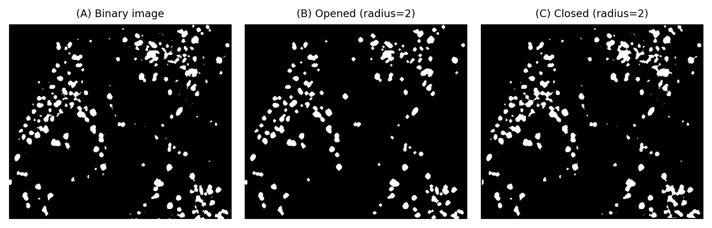

# 8.2 Opening & Closing


## 🧠 Overview

Used to remove noise and small artifacts from binary or grayscale images.

- **Opening**: Removes small white noises and smooths object boundaries.
- **Closing**: Fills small holes and connects nearby objects.

---

## 📐 Mathematical Definitions

- **Opening**:  
  \( A \circ B = (A \ominus B) \oplus B \)

- **Closing**:  
  \( A \bullet B = (A \oplus B) \ominus B \)

Where:
- \( A \): image
- \( B \): structuring element

---

## 🧪 OpenCV Code

```python
import cv2
import numpy as np

# Load the binary noisy image in grayscale
img = cv2.imread('noisy_binary.png', 0)

# Define a 5x5 kernel
kernel = np.ones((5, 5), np.uint8)

# Apply Morphological Opening (Erosion followed by Dilation)
opening = cv2.morphologyEx(img, cv2.MORPH_OPEN, kernel)

# Apply Morphological Closing (Dilation followed by Erosion)
closing = cv2.morphologyEx(img, cv2.MORPH_CLOSE, kernel)

# Display results
cv2.imshow("Original", img)
cv2.imshow("Opening", opening)
cv2.imshow("Closing", closing)

cv2.waitKey(0)
cv2.destroyAllWindows()

# Optional: Save results
# cv2.imwrite("opening_result.png", opening)
# cv2.imwrite("closing_result.png", closing)

```
### 💻 MATLAB Code
```matlab
% Read binary noisy image
img = imread('noisy_binary.png');

% Create a structuring element (disk shape with radius 3)
se = strel('disk', 3);

% Apply morphological Opening to remove small noise (erosion followed by dilation)
opening = imopen(img, se);

% Apply morphological Closing to fill small holes (dilation followed by erosion)
closing = imclose(img, se);

% Display the original and processed images
subplot(1,3,1), imshow(img), title('Original');
subplot(1,3,2), imshow(opening), title('Opening');    % Noise removed
subplot(1,3,3), imshow(closing), title('Closing');    % Holes filled

```

