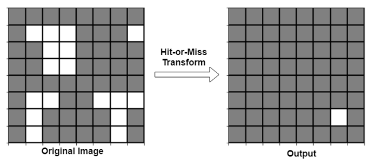
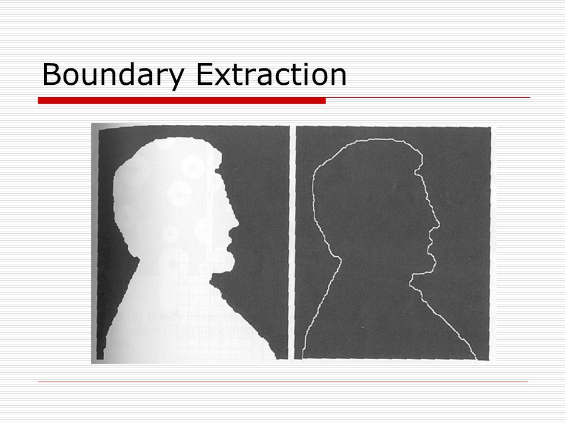
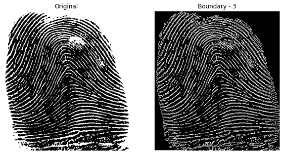

# 8.3 Hit-or-Miss & Boundary Extraction


## 🧠 Overview

- **Hit-or-Miss (ضرب أو فقد)**: Used for shape detection in binary images.
- **Boundary Extraction**: Highlights edges of shapes by subtracting eroded image from the original.

---

## 📐 Mathematical Definitions

- **Hit-or-Miss**:  
  \( A \otimes B = (A \ominus B_1) \cap (A^c \ominus B_2) \)



- **Boundary**:  
  \( \text{Boundary}(A) = A - (A \ominus B) \)

  

---

## 🧪 OpenCV Code

```python
import cv2
import numpy as np

# Load image in grayscale
img = cv2.imread('image.jpg', cv2.IMREAD_GRAYSCALE)

# Define a structuring element
kernel = np.ones((3, 3), np.uint8)

# Boundary Extraction: original image - eroded image
boundary = cv2.subtract(img, cv2.erode(img, kernel))

# Display result
cv2.imshow("Boundary", boundary)
cv2.waitKey(0)
cv2.destroyAllWindows()

```

---

## 💻 MATLAB Code

```matlab
% Load binary image (ensure it's binary before applying this)
img = imread('binary_image.jpg');
if size(img, 3) == 3
    img = rgb2gray(img); % Convert to grayscale if it's RGB
end
img = imbinarize(img); % Ensure binary

% Define structuring element
se = strel('square', 3); % You can change shape and size as needed

% Boundary Extraction
% Subtract the eroded image from the original to get boundaries
boundary = img - imerode(img, se);

% Display the result
imshow(boundary);
title('Extracted Boundary');

```


