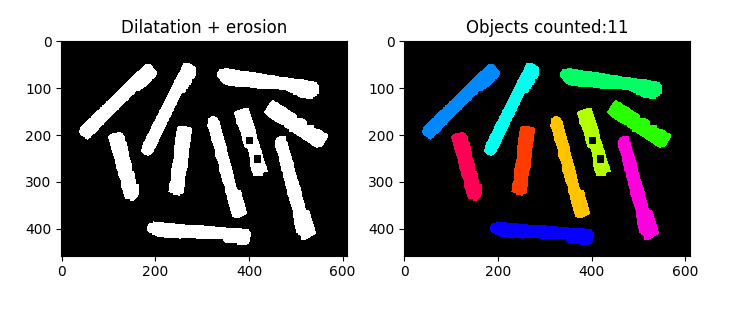

# 8.4 Applications in Binary Images


**Content**: Binary image ➝ Opening ➝ Count ➝ Label ➝ Display results.
## 🧠 Practical Use Cases


- Noise cleaning
- Object counting
- Shape matching
- Preprocessing for OCR and segmentation

---

## 🧪 OpenCV Example: Object Counting

```python
import cv2
import numpy as np

# Load the input image and convert it to grayscale
image = cv2.imread('image.jpg')
gray = cv2.cvtColor(image, cv2.COLOR_BGR2GRAY)

# Apply Otsu's thresholding to convert the image to binary
_, thresh = cv2.threshold(gray, 0, 255, cv2.THRESH_BINARY_INV + cv2.THRESH_OTSU)

# Remove noise using morphological opening (erosion followed by dilation)
kernel = np.ones((3, 3), np.uint8)
opening = cv2.morphologyEx(thresh, cv2.MORPH_OPEN, kernel, iterations=2)

# Find contours in the binary image
contours, _ = cv2.findContours(opening, cv2.RETR_EXTERNAL, cv2.CHAIN_APPROX_SIMPLE)

# Copy the original image to draw the results
output_image = image.copy()

# Draw the detected contours
cv2.drawContours(output_image, contours, -1, (0, 255, 0), 2)

# Display number of detected objects on the image
text = f'Objects Detected: {len(contours)}'
cv2.putText(output_image, text, (10, 30), cv2.FONT_HERSHEY_SIMPLEX, 1, (255, 0, 0), 2)

# Show the final image with drawn contours and text
cv2.imshow("Detected Objects", output_image)
cv2.waitKey(0)
cv2.destroyAllWindows()

```

---

## 💻 MATLAB Example: Object Counting

```matlab

% Read the input image
image = imread('image.jpg');

% Convert the image to grayscale
gray = rgb2gray(image);

% Apply Otsu's thresholding to convert the image to binary
level = graythresh(gray);
thresh = imbinarize(gray, level);
thresh = imcomplement(thresh); % Invert the binary image

% Remove noise using morphological opening
se = strel('square', 3);
opening = imopen(thresh, se);

% Find contours in the binary image
[contours, ~] = bwboundaries(opening, 'noholes');

% Create a copy of the original image to draw the results
output_image = image;

% Draw the detected contours
for k = 1:length(contours)
    boundary = contours{k};
    output_image = insertShape(output_image, 'Polygon', boundary, 'Color', 'green', 'LineWidth', 2);
end

% Display the number of detected objects on the image
text_str = sprintf('Objects Detected: %d', length(contours));
output_image = insertText(output_image, [10, 10], text_str, 'FontSize', 18, 'TextColor', 'red', 'BoxColor', 'white');

% Show the final image with drawn contours and text
imshow(output_image);
title('Detected Objects');

```


---


