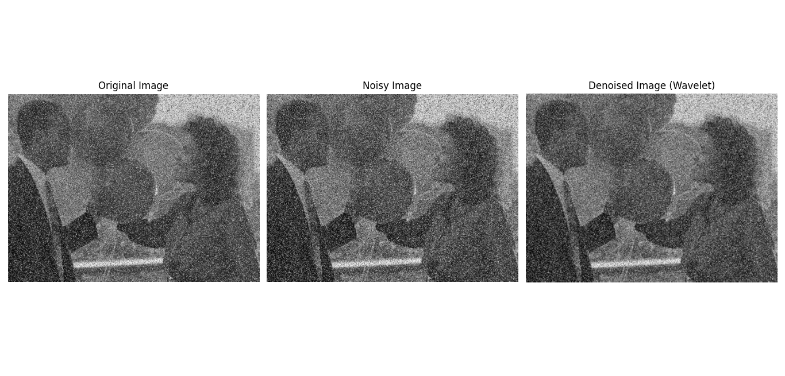

# Image Denoising Using Wavelets

- Wavelet Transform is a powerful tool for both image denoising and image enhancement. It allows processing in the frequency domain at multiple resolutions, making it ideal for removing noise and enhancing important features without over-sharpening.

## Why Use Wavelets?

- Unlike traditional Fourier transforms, wavelets provide both spatial and frequency localization. This makes them well-suited for separating noise (high-frequency) from important image features (low-frequency and structured components).

## 1. Image Denoising

Image denoising involves removing unwanted random variations in pixel intensity values (noise) while preserving image details.

## Common Noise Types:
- Gaussian Noise
- Salt-and-Pepper Noise
- Speckle Noise

## Denoising Steps:

1. Apply DWT to the noisy image.
2. Threshold the high-frequency subbands (e.g., LH, HL, HH).
3. Apply inverse DWT to reconstruct the denoised image.

## Equation

Soft thresholding:

\[
w' = \begin{cases}
\text{sign}(w) \cdot (|w| - \lambda), & \text{if } |w| > \lambda \\
0, & \text{otherwise}
\end{cases}
\]

Where \( w \) is the wavelet coefficient and \( \lambda \) is the threshold.


## Python Code (Denoising using Wavelets)

```python

import cv2  # Import OpenCV for image processing
import pywt  # Import PyWavelets for wavelet transforms
import numpy as np  # Import NumPy for numerical operations
import matplotlib.pyplot as plt  # Import Matplotlib for plotting

# --- Read and prepare the image ---
image = cv2.imread('balloons_noisy.jpg', cv2.IMREAD_GRAYSCALE)  # Read the image in grayscale mode
if image is None:
    raise FileNotFoundError("Image not found. Please check the file path.")  # Raise error if image is not found

# --- Add Gaussian noise to the image ---
noise_sigma = 20  # Set the standard deviation for Gaussian noise
noisy_image = image + np.random.normal(0, noise_sigma, image.shape)  # Add Gaussian noise to the image
noisy_image = np.clip(noisy_image, 0, 255).astype(np.uint8)  # Clip values to valid range and convert to uint8

# --- DWT Denoising ---
coeffs2 = pywt.dwt2(noisy_image, 'db4')  # Perform 2D Discrete Wavelet Transform using Daubechies 4 wavelet
cA, (cH, cV, cD) = coeffs2  # Unpack the coefficients: cA=Approximation, cH=Horizontal, cV=Vertical, cD=Diagonal

# Thresholding detail coefficients (soft threshold)
threshold = noise_sigma * np.sqrt(2 * np.log(image.size))  # Calculate threshold value for denoising
cH_denoised = pywt.threshold(cH, threshold, mode='soft')  # Apply soft thresholding to horizontal details
cV_denoised = pywt.threshold(cV, threshold, mode='soft')  # Apply soft thresholding to vertical details
cD_denoised = pywt.threshold(cD, threshold, mode='soft')  # Apply soft thresholding to diagonal details

# Reconstruct the denoised image
coeffs2_denoised = (cA, (cH_denoised, cV_denoised, cD_denoised))  # Prepare the denoised coefficients
denoised_image = pywt.idwt2(coeffs2_denoised, 'db4')  # Perform inverse DWT to reconstruct the image
denoised_image = np.clip(denoised_image, 0, 255).astype(np.uint8)  # Clip values and convert to uint8

# --- Show original, noisy, and denoised images ---
plt.figure(figsize=(15, 5))  # Create a figure with specified size
plt.subplot(1, 3, 1)  # First subplot for the original image
plt.imshow(image, cmap='gray')  # Display the original image in grayscale
plt.title('Original Image')  # Set title
plt.axis('off')  # Hide axis

plt.subplot(1, 3, 2)  # Second subplot for the noisy image
plt.imshow(noisy_image, cmap='gray')  # Display the noisy image in grayscale
plt.title('Noisy Image')  # Set title
plt.axis('off')  # Hide axis

plt.subplot(1, 3, 3)  # Third subplot for the denoised image
plt.imshow(denoised_image, cmap='gray')  # Display the denoised image in grayscale
plt.title('Denoised Image (Wavelet)')  # Set title
plt.axis('off')  # Hide axis

plt.tight_layout()  # Adjust subplot layout for better appearance
plt.show()  # Display all plots

```
## MATLAB Code Denoising using Wavelets 

```matlab

% Read the image in grayscale
image = imread('balloons_noisy.jpg');
if size(image,3) == 3
    image = rgb2gray(image); % Convert to grayscale if needed
end

% Add Gaussian noise to the image
noise_sigma = 20;
noisy_image = double(image) + randn(size(image)) * noise_sigma;
noisy_image = uint8(min(max(noisy_image, 0), 255)); % Clip to [0,255] and convert to uint8

% Perform 2D Discrete Wavelet Transform (DWT) using Daubechies 4 wavelet
[cA, cH, cV, cD] = dwt2(double(noisy_image), 'db4');

% Thresholding detail coefficients (soft threshold)
threshold = noise_sigma * sqrt(2 * log(numel(image)));
cH_denoised = wthresh(cH, 's', threshold);
cV_denoised = wthresh(cV, 's', threshold);
cD_denoised = wthresh(cD, 's', threshold);

% Reconstruct the denoised image
denoised_image = idwt2(cA, cH_denoised, cV_denoised, cD_denoised, 'db4');
denoised_image = uint8(min(max(denoised_image, 0), 255)); % Clip to [0,255] and convert to uint8

% Show original, noisy, and denoised images
figure('Position', [100, 100, 1200, 400]);
subplot(1,3,1);
imshow(image, []);
title('Original Image');
axis off;

subplot(1,3,2);
imshow(noisy_image, []);
title('Noisy Image');
axis off;

subplot(1,3,3);
imshow(denoised_image, []);
title('Denoised Image (Wavelet)');
axis off;

```
