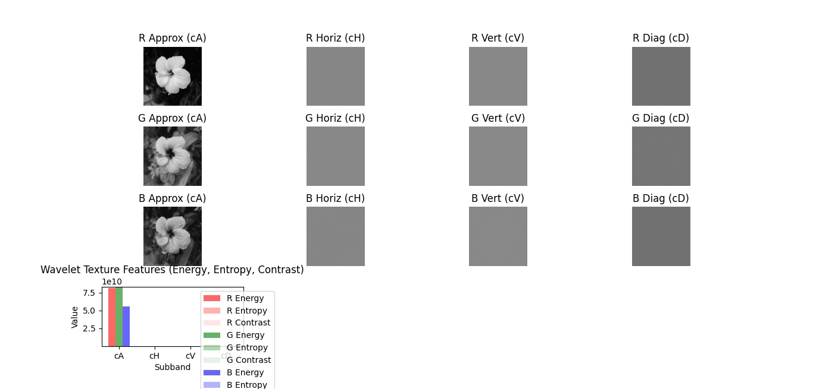

# Feature Extraction and Texture Analysis Using Wavelets

- Wavelet transform is widely used in image analysis for extracting texture features and other key characteristics. Its ability to analyze signals at multiple resolutions makes it ideal for analyzing both coarse and fine image structures.

## What is Feature Extraction?

- Feature extraction is the process of reducing the image data to a set of meaningful values that represent important characteristics such as edges, patterns, or textures.


## Wavelet Subbands

- After applying DWT, the image is decomposed into subbands:
  - LL: Approximation (low frequency)
  - LH, HL, HH: Detail (horizontal, vertical, diagonal)

- The energy and statistical properties of these subbands are used as features.

## Common Texture Features:

- Energy:
\[
E = \sum_{i,j} |C_{i,j}|^2
\]
- Where \( C_{i,j} \) is the coefficient at position (i, j).

- Entropy:
\[
H = -\sum p \log_2(p)
\]

- Where \( p \) is the normalized histogram of the subband.

- Mean and Standard Deviation of coefficients


## Python Code Texture Features

```python


# Import the OpenCV library for image processing
import cv2  
import pywt
# Import NumPy for numerical operations
import numpy as np  
# Import Matplotlib for plotting
import matplotlib.pyplot as plt  

# --- Read and prepare the color image ---
image = cv2.imread('flower.jpg')
if image is None:
    raise FileNotFoundError("Image not found. Please check the file path.")

image_rgb = cv2.cvtColor(image, cv2.COLOR_BGR2RGB)

# --- Texture feature extraction functions ---
def energy(subband):
    return np.sum(np.square(subband))

def entropy(subband):
    hist, _ = np.histogram(subband.flatten(), bins=256, density=True)
    hist = hist[hist > 0]
    return -np.sum(hist * np.log2(hist))

def contrast(subband):
    return np.mean(np.abs(subband - np.mean(subband)))

channels = ['R', 'G', 'B']
texture_features = {}
subbands = ['cA', 'cH', 'cV', 'cD']
energies_all = []
entropies_all = []
contrasts_all = []

# Create a grid for 3 channels x 4 subbands + 1 for the bar chart
fig, axs = plt.subplots(4, 4, figsize=(18, 14))
plt.subplots_adjust(hspace=0.35, wspace=0.15)

for i, channel in enumerate(channels):
    channel_data = image_rgb[:, :, i]
    coeffs2 = pywt.dwt2(channel_data, 'db4')
    cA, (cH, cV, cD) = coeffs2

    # Extract features
    texture_features[channel] = {
        'cA_energy': energy(cA),
        'cA_entropy': entropy(cA),
        'cA_contrast': contrast(cA),
        'cH_energy': energy(cH),
        'cH_entropy': entropy(cH),
        'cH_contrast': contrast(cH),
        'cV_energy': energy(cV),
        'cV_entropy': entropy(cV),
        'cV_contrast': contrast(cV),
        'cD_energy': energy(cD),
        'cD_entropy': entropy(cD),
        'cD_contrast': contrast(cD),
    }

    # Collect features for bar chart
    energies_all.append([texture_features[channel][f'{sb}_energy'] for sb in subbands])
    entropies_all.append([texture_features[channel][f'{sb}_entropy'] for sb in subbands])
    contrasts_all.append([texture_features[channel][f'{sb}_contrast'] for sb in subbands])

    # DWT subbands visualization
    axs[i, 0].imshow(cA, cmap='gray')
    axs[i, 0].set_title(f'{channel} Approx (cA)')
    axs[i, 0].axis('off')

    axs[i, 1].imshow(cH, cmap='gray')
    axs[i, 1].set_title(f'{channel} Horiz (cH)')
    axs[i, 1].axis('off')

    axs[i, 2].imshow(cV, cmap='gray')
    axs[i, 2].set_title(f'{channel} Vert (cV)')
    axs[i, 2].axis('off')

    axs[i, 3].imshow(cD, cmap='gray')
    axs[i, 3].set_title(f'{channel} Diag (cD)')
    axs[i, 3].axis('off')

# Bar chart for all channels in the last row
ax = axs[3, :]
fig.delaxes(ax[1])
fig.delaxes(ax[2])
fig.delaxes(ax[3])

x = np.arange(len(subbands))
width = 0.2
bar_colors = ['red', 'green', 'blue']

for idx, channel in enumerate(channels):
    ax[0].bar(x + width*idx - width, energies_all[idx], width, label=f'{channel} Energy', color=bar_colors[idx], alpha=0.6)
    ax[0].bar(x + width*idx - width, entropies_all[idx], width, label=f'{channel} Entropy', color=bar_colors[idx], alpha=0.3, bottom=energies_all[idx])
    ax[0].bar(x + width*idx - width, contrasts_all[idx], width, label=f'{channel} Contrast', color=bar_colors[idx], alpha=0.1, bottom=np.array(energies_all[idx])+np.array(entropies_all[idx]))

ax[0].set_xticks(x)
ax[0].set_xticklabels(subbands)
ax[0].set_title('Wavelet Texture Features (Energy, Entropy, Contrast)')
ax[0].legend(loc='upper right', bbox_to_anchor=(1.25, 1))
ax[0].set_xlabel('Subband')
ax[0].set_ylabel('Value')
plt.show()

```

## Matlab code Texture Features

```matlab

% Read and prepare the color image
img = imread('flower.jpg');
if size(img,3) ~= 3
    error('Image must be RGB.');
end

channels = {'R', 'G', 'B'};
subbands = {'cA', 'cH', 'cV', 'cD'};
energies_all = [];
entropies_all = [];
contrasts_all = [];

figure('Position', [100, 100, 1400, 1000]);
for i = 1:3
    channel_data = double(img(:,:,i));
    [cA, cH, cV, cD] = dwt2(channel_data, 'db4');

    % Feature extraction
    energy = @(x) sum(x(:).^2);
    entropy_f = @(x) -sum(nonzeros(histcounts(x(:),256,'Normalization','probability')) .* ...
        log2(nonzeros(histcounts(x(:),256,'Normalization','probability'))));
    contrast = @(x) mean(abs(x(:) - mean(x(:))));

    energies = [energy(cA), energy(cH), energy(cV), energy(cD)];
    entropies = [entropy_f(cA), entropy_f(cH), entropy_f(cV), entropy_f(cD)];
    contrasts = [contrast(cA), contrast(cH), contrast(cV), contrast(cD)];

    energies_all = [energies_all; energies];
    entropies_all = [entropies_all; entropies];
    contrasts_all = [contrasts_all; contrasts];

    % DWT subbands visualization
    subplot(4,4,(i-1)*4+1); imagesc(cA); colormap gray; axis off;
    title([channels{i} ' Approx (cA)']);
    subplot(4,4,(i-1)*4+2); imagesc(cH); colormap gray; axis off;
    title([channels{i} ' Horiz (cH)']);
    subplot(4,4,(i-1)*4+3); imagesc(cV); colormap gray; axis off;
    title([channels{i} ' Vert (cV)']);
    subplot(4,4,(i-1)*4+4); imagesc(cD); colormap gray; axis off;
    title([channels{i} ' Diag (cD)']);
end

% Bar chart for all channels in the last row
subplot(4,4,13:16);
x = 1:length(subbands);
width = 0.2;
hold on;
bar(x-width, energies_all(1,:), width, 'FaceColor', [1 0 0 0.6], 'DisplayName', 'R Energy');
bar(x, entropies_all(1,:), width, 'FaceColor', [1 0 0 0.3], 'DisplayName', 'R Entropy');
bar(x+width, contrasts_all(1,:), width, 'FaceColor', [1 0 0 0.1], 'DisplayName', 'R Contrast');

bar(x-width, energies_all(2,:), width, 'FaceColor', [0 1 0 0.6], 'DisplayName', 'G Energy');
bar(x, entropies_all(2,:), width, 'FaceColor', [0 1 0 0.3], 'DisplayName', 'G Entropy');
bar(x+width, contrasts_all(2,:), width, 'FaceColor', [0 1 0 0.1], 'DisplayName', 'G Contrast');

bar(x-width, energies_all(3,:), width, 'FaceColor', [0 0 1 0.6], 'DisplayName', 'B Energy');
bar(x, entropies_all(3,:), width, 'FaceColor', [0 0 1 0.3], 'DisplayName', 'B Entropy');
bar(x+width, contrasts_all(3,:), width, 'FaceColor', [0 0 1 0.1], 'DisplayName', 'B Contrast');

set(gca, 'XTick', x, 'XTickLabel', subbands);
title('Wavelet Texture Features (Energy, Entropy, Contrast)');
xlabel('Subband');
ylabel('Value');
legend('show');
hold off;

```
