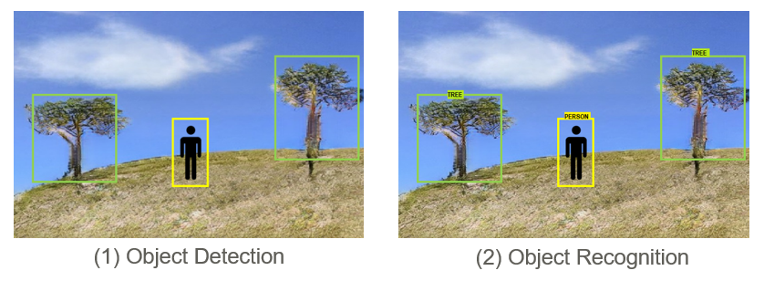
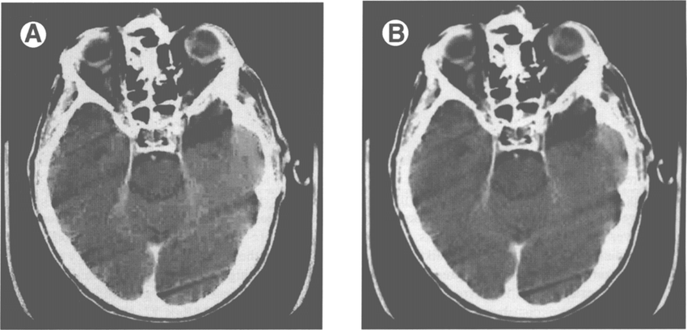
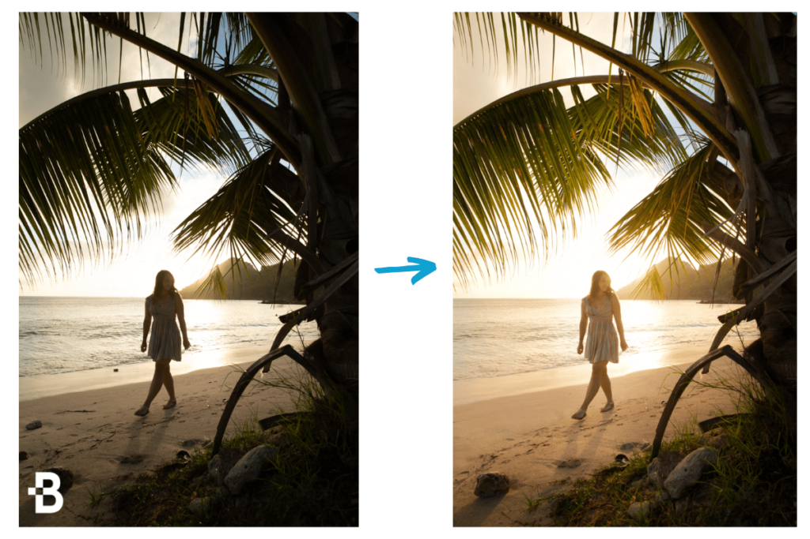
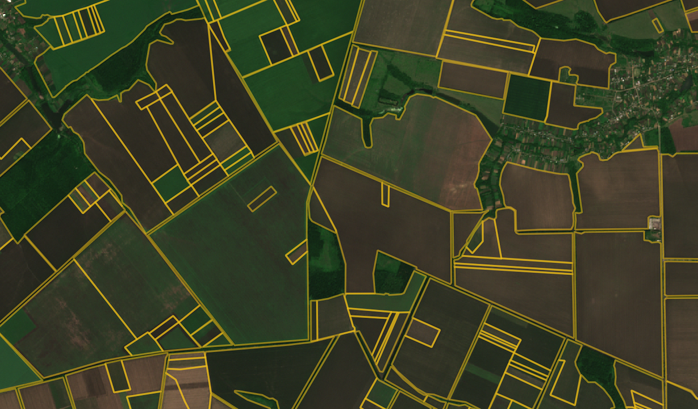

# 📄1.Introduction to Image Segmentation
 
<video src="photows/ImageSegmentation11.mp4" width="800" height="410" controls>
    Your browser does not support the video tag.
  </video>


## 🧠 Overview
* Image segmentation is a fundamental step in many image processing, computer vision, and machine learning applications. It involves **dividing an image into meaningful regions** that share similar characteristics, such as color, intensity, or texture.

* The goal is to simplify or change the representation of an image into something more meaningful and easier to analyze.

* For example, in medical imaging, segmentation can be used to locate tumors, measure tissue volumes, or follow disease progression. In self-driving cars, it helps identify roads, pedestrians, and obstacles.

* Segmentation is often a **preprocessing step** for tasks like object detection, recognition, and tracking.

---

## 📌2.Applications of Image Segmentation

- 🎯 **1.Object Recognition**  
  Helps detect and classify specific objects (e.g., faces, cars, animals) in an image.



---

- 🗜️ **2.Compression**  
  By segmenting areas with similar features, image data can be compressed more efficiently.



---

- 🖌️ **3.Image Editing**  
  Enables selective editing (e.g., changing the color of only the background).



---
- 🧱 **4.Occlusion Boundary Estimation**  
  Determines boundaries between overlapping objects, useful in 3D modeling or tracking.


---

## 🧮 Equation

**K-Means Objective Function:**

\[
J = \sum_{i=1}^{k} \sum_{x \in C_i} \| x - \mu_i \|^2
\]

Where:
- \( C_i \): Set of points in cluster \( i \)  
- \( \mu_i \): Centroid of cluster \( i \)

---

## 🐍 Python (OpenCV)

```python
import cv2
import numpy as np

# Load the input image
img = cv2.imread('image.jpg')

# Reshape the image into a 2D array of pixels and convert to float32
Z = img.reshape((-1, 3)).astype(np.float32)

# Define the criteria for K-means:
# Stop either after 10 iterations or if the accuracy is less than 1.0
criteria = (cv2.TERM_CRITERIA_EPS + cv2.TERM_CRITERIA_MAX_ITER, 10, 1.0)

K = 3  # Number of clusters (segments)

# Apply K-means clustering
# Returns compactness, labels, and centers
_, label, center = cv2.kmeans(Z, K, None, criteria, 10, cv2.KMEANS_RANDOM_CENTERS)

# Convert centers to uint8 (pixel values)
center = np.uint8(center)

# Replace each pixel with its corresponding center value
segmented = center[label.flatten()].reshape(img.shape)

# Display the segmented image
cv2.imshow('Segmented Image', segmented)
cv2.waitKey(0)
cv2.destroyAllWindows()

```

## 📘 MATLAB
```MATLAB
% Read the input image
I = imread('image.jpg');

% Reshape the image into an N x 3 array where each row is a pixel (R, G, B)
% and convert to double for k-means processing
data = im2double(reshape(I, [], 3));

% Apply k-means clustering to segment the image into 3 clusters
[idx, C] = kmeans(data, 3);

% Reconstruct the segmented image using the cluster centers
seg_img = reshape(C(idx, :), size(I));

% Display the segmented image
imshow(seg_img);
title('Segmented Image using K-means');


```