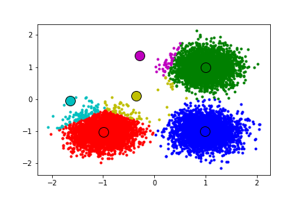

## 🌀3.Mean-Shift Segmentation

### 📚 Concept  
Mean-Shift is a **non-parametric clustering** method based on kernel density estimation. It iteratively moves data points towards the mode (densest region) of the feature space, making it ideal for segmenting images without needing the number of clusters in advance.

---

### 🧮 Equation

\[
m(x) = \frac{\sum_{i} x_i \cdot K\left(\frac{x - x_i}{h}\right)}{\sum_{i} K\left(\frac{x - x_i}{h}\right)} - x
\]

Where:  
- \( x \): current location  
- \( x_i \): neighbor points  
- \( h \): bandwidth  
- \( K \): kernel function (e.g., Gaussian)

---

### 🐍 Python Code

```python
from sklearn.cluster import MeanShift
import numpy as np
import cv2

img = cv2.imread('image.jpg')
Z = img.reshape((-1, 3))

ms = MeanShift()
ms.fit(Z)
labels = ms.labels_

# Reshape labels to image
segmented = np.reshape(labels, (img.shape[0], img.shape[1]))

cv2.imshow("Mean-Shift Segmentation", segmented.astype(np.uint8))
cv2.waitKey(0)
cv2.destroyAllWindows()

```
📘 **MATLAB:**

```MATLAB

% No built-in Mean-Shift in MATLAB.
% Use EDISON system: http://www.caip.rutgers.edu/riul/research/code/EDISON/

% Example (if using toolbox)
I = imread('image.jpg');
[seg_img, ~] = edison_wrapper(I, struct('SpatialBandWidth', 7));
imshow(seg_img);

```

---
