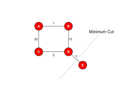
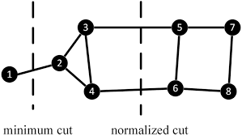

# 4.Normalized Cut & Min Cut


## ✂️ Min Cut Segmentation

### 📚 Concept
Min Cut partitions the image graph into disjoint subsets by minimizing the total weight of the edges cut. However, it often produces unbalanced partitions (e.g., small isolated regions).

### 🧮 Equation

$$
\text{cut}(A, B) = \sum_{u \in A, v \in B} w(u, v)
$$

Where:

- **A, B**: two partitions
- **w(u, v)**: weight (similarity) between nodes **u** and **v**


---


## 🔄 Normalized Cut (Ncut)

### 📚 Concept
Normalized Cut improves Min Cut by considering both dissimilarity across groups and similarity within groups, avoiding small isolated clusters.

### 🧮 Equation

$$
\text{Ncut}(A, B) = \frac{\text{cut}(A, B)}{\text{assoc}(A, V)} + \frac{\text{cut}(A, B)}{\text{assoc}(B, V)}
$$

Where:

- **assoc(A, V)** = $\sum_{u \in A, t \in V} w(u, t)$

---

## 🐍 Python Code Image Segmentation


```python
import cv2
import numpy as np

# Load the input image
image = cv2.imread('image.jpg')

# Convert the image to grayscale
gray_image = cv2.cvtColor(image, cv2.COLOR_BGR2GRAY)

# Apply Gaussian blur to reduce noise
blurred_image = cv2.GaussianBlur(gray_image, (5, 5), 0)

# Create an initial mask (required by GrabCut)
mask = np.zeros(image.shape[:2], np.uint8)

# Create temporary arrays used by GrabCut to model background and foreground
bgd_model = np.zeros((1, 65), np.float64)
fgd_model = np.zeros((1, 65), np.float64)

# Define a rectangle that roughly contains the foreground object
rect = (10, 10, image.shape[1] - 10, image.shape[0] - 10)

# Apply the GrabCut algorithm
# It modifies 'mask' in-place using the rectangle and models
cv2.grabCut(image, mask, rect, bgd_model, fgd_model, 5, cv2.GC_INIT_WITH_RECT)

# Create a binary mask: set pixels classified as background (0, 2) to 0 and foreground (1, 3) to 1
mask2 = np.where((mask == 2) | (mask == 0), 0, 1).astype('uint8')

# Apply the mask to the original image to obtain the segmented image
segmented_image = image * mask2[:, :, np.newaxis]

# Display the original and segmented images
cv2.imshow('Original Image', image)
cv2.imshow('Segmented Image', segmented_image)
cv2.waitKey(0)
cv2.destroyAllWindows()


```

## MATLAB Code Image Segmentation

```matlab
% Read the input image
image = imread('image.jpg');
image = im2double(image);  % Convert to double for precision

% Convert the image to grayscale
gray_image = rgb2gray(image);

% Apply Gaussian blur to reduce noise
blurred_image = imgaussfilt(gray_image, 2);

% Get image dimensions
[rows, cols] = size(gray_image);
num_nodes = rows * cols;  % Each pixel is treated as a node

% Initialize the graph as an adjacency matrix
graph = zeros(num_nodes, num_nodes);

% Construct the weighted graph
for i = 1:rows
    for j = 1:cols
        for m = max(i-1, 1):min(i+1, rows)
            for n = max(j-1, 1):min(j+1, cols)
                node_1 = (i-1) * cols + j;
                node_2 = (m-1) * cols + n;
                
                % Compute weight based on pixel intensity similarity
                weight = exp(-abs(gray_image(i,j) - gray_image(m,n)));
                
                % Assign weight to the graph
                graph(node_1, node_2) = weight;
            end
        end
    end
end

% Define two arbitrary segments A and B (just for illustration)
A = 1:round(num_nodes/2);
B = round(num_nodes/2)+1:num_nodes;

% Calculate the cut value between A and B
cut_value = sum(sum(graph(A, B)));

% Compute association of each segment to the full graph
assoc_A = sum(sum(graph(A, :)));
assoc_B = sum(sum(graph(B, :)));

% Compute the Normalized Cut value
Ncut_value = (cut_value / assoc_A) + (cut_value / assoc_B);

% Display the computed Ncut value
fprintf('Normalized Cut value: %.4f\n', Ncut_value);

% Visualize the segmented result
segmented_image = gray_image;
segmented_image(A) = 0;  % Mark region A as black
segmented_image(B) = 1;  % Mark region B as white

imshow(segmented_image);
title('Segmented Image with Normalized Cut');


```


