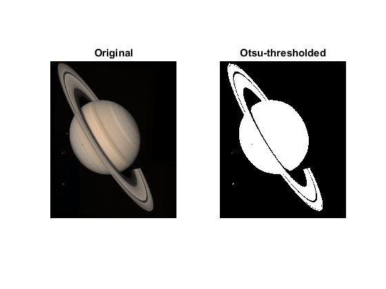

# 5.Thresholding Methods

<video src="photows/thresholdingtechniques.mp4" controls>
  </video>


---
#### 1-Global Thresholding 🐍💻

#### 🌟 Concept

In Global Thresholding, a single threshold value is applied across the entire image to separate the foreground from the background. It works well for images with uniform lighting.

#### 🧮 Mathematical Equation
\[
f(x, y) = 
\begin{cases} 
1 & \text{if } g(x, y) \geq T \\
0 & \text{if } g(x, y) < T 
\end{cases}
\]
Where:
- \( f(x, y) \) is the resulting binary image.
- \( g(x, y) \) is the pixel intensity of the original grayscale image.
- \( T \) is the threshold value.

#### 🐍 Python Code (OpenCV)

```python
import cv2
import numpy as np

# Load image
image = cv2.imread('image.jpg', cv2.IMREAD_GRAYSCALE)

# Global Thresholding
_, global_thresh = cv2.threshold(image, 127, 255, cv2.THRESH_BINARY)

# Display results
cv2.imshow("Global Threshold", global_thresh)
cv2.waitKey(0)
cv2.destroyAllWindows()

```
### 💻 MATLAB Code
```Matlab
% Load image
image = imread('image.jpg');
gray_image = rgb2gray(image);

% Global Thresholding
threshold_value = 127;
binary_image = gray_image >= threshold_value;

% Display results
imshow(binary_image);
title('Global Thresholding');

```


---
#### 2-Adaptive Thresholding 🐍💻

#### 🌈 Concept
Adaptive Thresholding calculates the threshold for smaller regions of the image, making it effective for images with varying lighting conditions.

#### 🧮 Mathematical Equation
\[
T(x, y) = \text{mean}(g(x, y)) - C
\]
Where:
- \( T(x, y) \) is the threshold value at pixel \( (x, y) \).
- \( g(x, y) \) is the pixel intensity at position \( (x, y) \).
- \( C \) is a constant that adjusts the threshold based on local conditions.

#### 🐍 Python Code (OpenCV)

```python
import cv2
import numpy as np

# Load image
image = cv2.imread('image.jpg', cv2.IMREAD_GRAYSCALE)

# Adaptive Thresholding
adaptive_thresh = cv2.adaptiveThreshold(image, 255, cv2.ADAPTIVE_THRESH_MEAN_C, cv2.THRESH_BINARY, 11, 2)

# Display results
cv2.imshow("Adaptive Threshold", adaptive_thresh)
cv2.waitKey(0)
cv2.destroyAllWindows()
```
### 💻 MATLAB Code

```Matlab
% Load image
image = imread('image.jpg');
gray_image = rgb2gray(image);

% Adaptive Thresholding
adaptive_thresh = adaptthresh(gray_image, 0.5, 'NeighborhoodSize', [11 11]);

% Display results
imshow(adaptive_thresh);
title('Adaptive Thresholding');

```


---

#### 3-Otsu's Thresholding 🐍💻

#### 🎯 Concept
Otsu's Thresholding computes the optimal threshold that minimizes the variance within the foreground and background. This method is automatic and does not require the user to set the threshold.

#### 🧮 Mathematical Equation
\[
\sigma_B^2(T) = \left( m_1(T) - m_2 \right)^2 \frac{\sigma_1^2(T) + \sigma_2^2(T)}{}
\]
Where:
- \( m_1(T) \) and \( m_2 \) are the means of the two classes (foreground and background).
- \( \sigma_1^2(T) \) and \( \sigma_2^2(T) \) are the variances for each class.

#### 🐍 Python Code (OpenCV)

```python
import cv2
import numpy as np

# Load image in grayscale
image = cv2.imread('image.jpg', cv2.IMREAD_GRAYSCALE)

# Apply Otsu's Thresholding
_, otsu_thresh = cv2.threshold(image, 0, 255, cv2.THRESH_BINARY + cv2.THRESH_OTSU)

# Display the result
cv2.imshow("Otsu's Threshold", otsu_thresh)
cv2.waitKey(0)
cv2.destroyAllWindows()

```
### 💻 MATLAB Code 
```Matlab 
% Load image
image = imread('image.jpg');
gray_image = rgb2gray(image);  % Convert the image to grayscale

% Otsu's Thresholding
level = graythresh(gray_image);  % Compute Otsu's threshold
otsu_image = imbinarize(gray_image, level);  % Apply the threshold to binarize the image

% Display results
imshow(otsu_image);  % Show the binarized image
title("Otsu's Thresholding");  % Set the title of the image

```

