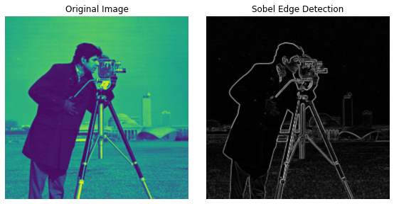
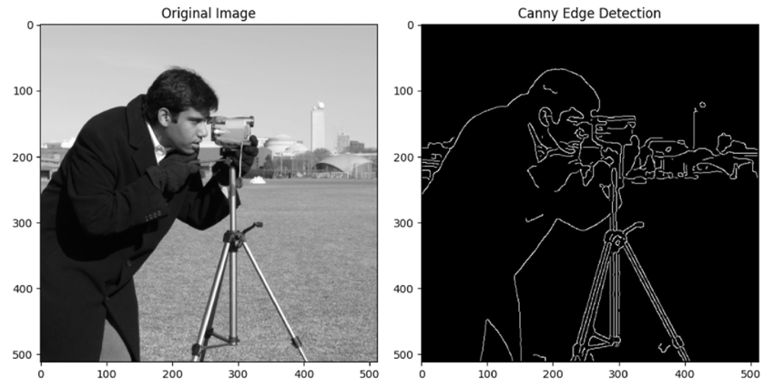
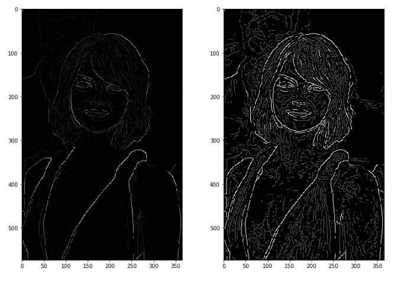

# 6.Edge-Based Segmentation


## 1-Sobel Edge Detection 🐍💻

🔍 **Concept**: Sobel Edge Detection detects edges in an image by calculating the gradient at each pixel using convolution with Sobel filters in both horizontal and vertical directions.

#### 🧮 Mathematical Equation:
\[
G_x = 
\begin{bmatrix}
-1 & 0 & 1 \\
-2 & 0 & 2 \\
-1 & 0 & 1
\end{bmatrix} * I(x, y)
\]
Where:
- \( G_x \) is the gradient in the x-direction.
- \( I(x, y) \) is the image intensity at pixel \( (x, y) \).

#### 🐍 Python Code (OpenCV):
```python
iimport cv2
import numpy as np

# Load image in grayscale mode
image = cv2.imread('image.jpg', cv2.IMREAD_GRAYSCALE)

# Apply Sobel Edge Detection
sobel_x = cv2.Sobel(image, cv2.CV_64F, 1, 0, ksize=3)  # Horizontal edges
sobel_y = cv2.Sobel(image, cv2.CV_64F, 0, 1, ksize=3)  # Vertical edges
sobel_edges = cv2.magnitude(sobel_x, sobel_y)         # Compute gradient magnitude

# Display results
cv2.imshow("Sobel Edge Detection", sobel_edges)        # Show the result
cv2.waitKey(0)                                         # Wait for a key press
cv2.destroyAllWindows()                                # Close the window

```
### 💻 MATLAB Code
 ```Matlab
 % Load image
image = imread('image.jpg');                      % Read the input image
gray_image = rgb2gray(image);                     % Convert the image to grayscale

% Sobel Edge Detection
sobel_x = imfilter(double(gray_image), [-1 0 1;   % Apply Sobel filter in the x-direction
                                        -2 0 2; 
                                        -1 0 1]);
sobel_y = imfilter(double(gray_image), [-1 -2 -1; % Apply Sobel filter in the y-direction
                                         0  0  0;
                                         1  2  1]);
sobel_edges = sqrt(sobel_x.^2 + sobel_y.^2);      % Compute the gradient magnitude

% Display results
imshow(sobel_edges, []);                          % Display the edge-detected image
title('Sobel Edge Detection');                    % Add a title to the figure

 ```

  

---
 ## Canny Edge Detection 🐍💻

## ⚡ Concept
Canny Edge Detection is a multi-step image processing technique designed to detect edges in an image by identifying areas with rapid intensity changes. The process includes:

1. **Smoothing**: Reducing noise using a Gaussian filter.
2. **Gradient Calculation**: Detecting intensity changes using gradient filters.
3. **Non-Maximum Suppression**: Thinning the edges.
4. **Edge Tracking by Hysteresis**: Finalizing edges based on thresholding.

---

### 🔢 Mathematical Concept

### 1. Gaussian Smoothing
To reduce noise, apply a Gaussian filter:

$$
G(x, y) = \frac{1}{2\pi\sigma^2} \exp\left( -\frac{x^2 + y^2}{2\sigma^2} \right)
$$

### 2. Gradient Calculation
Compute gradients in the x and y directions:

$$
G_x = \frac{\partial I}{\partial x}, \quad G_y = \frac{\partial I}{\partial y}
$$

The gradient magnitude:

$$
G = \sqrt{G_x^2 + G_y^2}
$$

### 3. Non-Maximum Suppression
Only retain local maxima along the gradient direction to thin edges.

### 4. Hysteresis Thresholding
Apply two thresholds to distinguish strong, weak, and irrelevant edges.

$$
Edge(x, y) = \begin{cases}
1 & \text{if } G(x, y) \geq T_{high} \\
0 & \text{if } G(x, y) < T_{low} \\
\text{Connected to strong edge} & \text{otherwise}
\end{cases}
$$

---

## 🐍 Python (OpenCV)
```python
import cv2
import matplotlib.pyplot as plt

# Load and convert image to grayscale
image = cv2.imread('image.jpg')                            # Load the input image
gray = cv2.cvtColor(image, cv2.COLOR_BGR2GRAY)             # Convert the image to grayscale

# Apply Canny Edge Detection
edges = cv2.Canny(gray, threshold1=100, threshold2=200)    # Perform Canny edge detection

# Show result
plt.figure(figsize=(10, 5))

# Display original image
plt.subplot(1, 2, 1)
plt.imshow(cv2.cvtColor(image, cv2.COLOR_BGR2RGB))         # Convert BGR to RGB for correct color display
plt.title("Original Image")
plt.axis('off')

# Display edge-detected image
plt.subplot(1, 2, 2)
plt.imshow(edges, cmap='gray')                             # Show edges in grayscale
plt.title("Canny Edge Detection")
plt.axis('off')

plt.tight_layout()
plt.show()

```

---

## 📓 MATLAB

```matlab

% Read and convert to grayscale
image = imread('image.jpg');          % Load the input image
gray = rgb2gray(image);               % Convert the image to grayscale

% Apply Canny edge detection
edges = edge(gray, 'Canny');          % Detect edges using the Canny method

% Display the result
subplot(1,2,1), imshow(image), title('Original Image');  % Show original image
subplot(1,2,2), imshow(edges), title('Canny Edge Detection');  % Show edge-detected image

```


