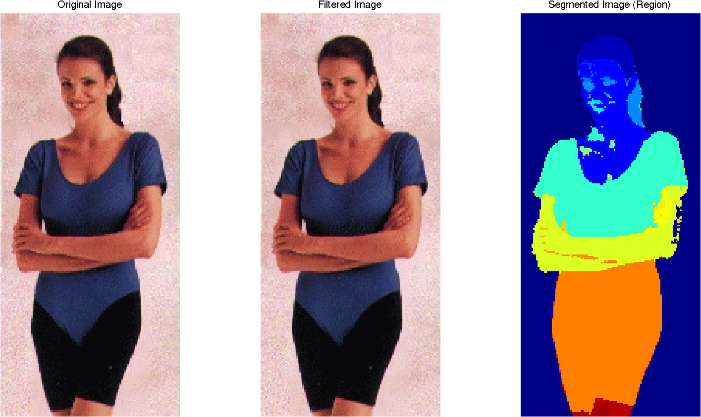
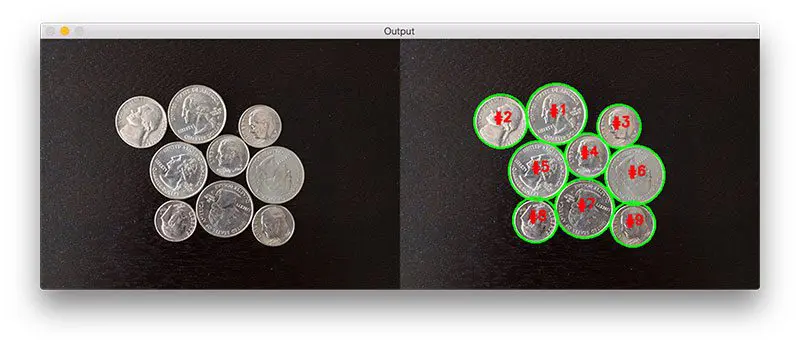
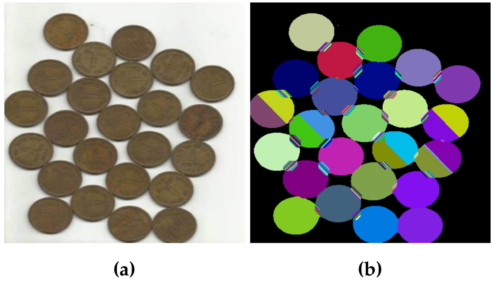

# 7-Region-Based Segmentation 


<video src="photows/Regionbased.mp4" width="800" height="410" controls>
    Your browser does not support the video tag.
  </video>


---
## ⚡ Concept
Region-based segmentation is a technique that groups pixels or subregions into larger regions based on predefined criteria. It is particularly effective when neighboring pixels share similar properties. The main types include:

1. **Region Growing** 🌱
2. **Watershed Segmentation** 💧

---

## 🔢 Mathematical Concept

### 1. Region Growing 🌱
This method starts with a set of seed points and grows regions by appending neighboring pixels that satisfy a similarity criterion (e.g., intensity difference within a threshold \( T \)).

#### Criterion:
\[
|I(x, y) - I(s_x, s_y)| < T
\]
Where \( (s_x, s_y) \) is a seed point and \( I(x, y) \) is the intensity of a neighboring pixel.


---

## 🐍 Python (OpenCV)

### Region Growing
```python
import cv2
import numpy as np

# Read image and convert it to grayscale
image = cv2.imread('image.jpg')
gray = cv2.cvtColor(image, cv2.COLOR_BGR2GRAY)

# Initialize visited map and output segmented image
visited = np.zeros_like(gray, dtype=bool)       # Keeps track of visited pixels
segmented = np.zeros_like(gray, dtype=np.uint8) # Output binary segmented image

# Define seed point and threshold
seed = (100, 100)               # Starting point for region growing
threshold = 10                  # Intensity difference threshold
value = gray[seed]              # Intensity value at seed point
stack = [seed]                  # Stack for region growing (DFS approach)

# Region Growing Algorithm
while stack:
    x, y = stack.pop()          # Get the current pixel
    if visited[x, y]:           # Skip if already visited
        continue
    visited[x, y] = True        # Mark as visited

    # Check if pixel is similar to the seed (within threshold)
    if abs(int(gray[x, y]) - int(value)) < threshold:
        segmented[x, y] = 255   # Mark pixel as foreground in the output

        # Check 8-connected neighbors
        for dx in [-1, 0, 1]:
            for dy in [-1, 0, 1]:
                nx, ny = x + dx, y + dy
                if 0 <= nx < gray.shape[0] and 0 <= ny < gray.shape[1]:
                    stack.append((nx, ny))  # Add neighbor to stack for checking

# Display the result
cv2.imshow("Region Growing", segmented)
cv2.waitKey(0)
cv2.destroyAllWindows()

```
---
## 📓 MATLAB code 

### Region Growing
```matlab
image = imread('image.jpg');           % Read the input image
gray = rgb2gray(image);                % Convert to grayscale

% Initialize variables
seed = [100, 100];                     % Starting point (seed)
threshold = 10;                        % Intensity difference threshold
segmented = false(size(gray));        % Output mask for segmented region
visited = false(size(gray));          % Tracks visited pixels
stack = seed;                          % Stack to explore neighboring pixels

% Region Growing Algorithm
while ~isempty(stack)
    [x, y] = deal(stack(1, 1), stack(1, 2));  % Get current pixel
    stack(1, :) = [];                         % Remove from stack
    if visited(x, y)
        continue;
    end
    visited(x, y) = true;
    % Check if intensity difference is within the threshold
    if abs(double(gray(x, y)) - double(gray(seed(1), seed(2)))) < threshold
        segmented(x, y) = true;              % Mark as part of region
        % Add neighbors to the stack
        for dx = -1:1
            for dy = -1:1
                nx = x + dx;
                ny = y + dy;
                if nx > 0 && ny > 0 && nx <= size(gray,1) && ny <= size(gray,2)
                    stack(end + 1, :) = [nx, ny];
                end
            end
        end
    end
end

imshow(segmented);                   % Display segmented image
title('Region Growing');

```


---
### 2. Watershed Segmentation 💧
Watershed treats the image as a topographic surface where pixel values represent elevation. Flooding begins from regional minima and builds catchment basins.

#### Gradient Magnitude:
\[
G(x, y) = \sqrt{G_x^2 + G_y^2}
\]
Where \( G_x \) and \( G_y \) are the gradients in the x and y directions respectively.

Flooding stops when basins meet, forming watershed lines (segmentation boundaries).


---
## 🐍 Python (OpenCV)

### Watershed

```python
import cv2
import numpy as np

# Step 1: Read the image and convert to grayscale
image = cv2.imread('image.jpg')
gray = cv2.cvtColor(image, cv2.COLOR_BGR2GRAY)

# Step 2: Apply Otsu's Thresholding with Binary Inversion
ret, thresh = cv2.threshold(gray, 0, 255, cv2.THRESH_BINARY_INV + cv2.THRESH_OTSU)

# Step 3: Remove noise using Morphological Opening (erosion followed by dilation)
kernel = np.ones((3, 3), np.uint8)
opening = cv2.morphologyEx(thresh, cv2.MORPH_OPEN, kernel, iterations=2)

# Step 4: Get sure background area by dilating the result
sure_bg = cv2.dilate(opening, kernel, iterations=3)

# Step 5: Get sure foreground area using Distance Transform and thresholding
dist_transform = cv2.distanceTransform(opening, cv2.DIST_L2, 5)
ret, sure_fg = cv2.threshold(dist_transform, 0.7 * dist_transform.max(), 255, 0)

# Step 6: Determine unknown region (i.e., boundary between foreground and background)
sure_fg = np.uint8(sure_fg)
unknown = cv2.subtract(sure_bg, sure_fg)

# Step 7: Marker labeling for the connected components
ret, markers = cv2.connectedComponents(sure_fg)

# Step 8: Add 1 to all labels so that background is not 0, and mark the unknown region with 0
markers = markers + 1
markers[unknown == 255] = 0

# Step 9: Apply Watershed algorithm
markers = cv2.watershed(image, markers)

# Step 10: Mark boundaries with red color (pixels with value -1)
image[markers == -1] = [0, 0, 255]

# Display the segmented result
cv2.imshow('Watershed Result', image)
cv2.waitKey(0)
cv2.destroyAllWindows()

```

---
## 📓 MATLAB code

### Watershed
```matlab
image = imread('image.jpg');          % Read the input image
gray = rgb2gray(image);               % Convert to grayscale

% Compute gradient magnitude using Sobel filters
hy = fspecial('sobel');               % Sobel filter in y-direction
hx = hy';                             % Sobel filter in x-direction
grad_x = imfilter(double(gray), hx, 'replicate');  % x-gradient
grad_y = imfilter(double(gray), hy, 'replicate');  % y-gradient
grad_mag = sqrt(grad_x.^2 + grad_y.^2);            % Gradient magnitude

% Apply Watershed segmentation
L = watershed(grad_mag);             % Apply watershed algorithm
segmented = label2rgb(L);            % Convert labels to color for visualization

imshow(segmented);                   % Display segmented image
title('Watershed Segmentation');

```



