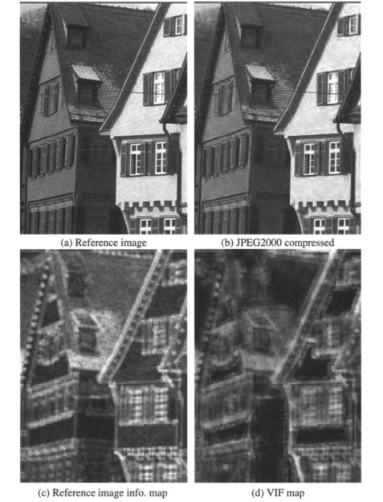

# 2. Fidelity Criteria


##  What is Fidelity in Image Compression?

- Fidelity refers to the quality of the reconstructed image after compression. It measures how closely the output image resembles the original.

### There are two main types of fidelity criteria:

- Subjective Fidelity: Based on human visual judgment.
- Objective Fidelity: Based on mathematical measures.
  
 


##  Objective Fidelity Measures

### 1. Mean Absolute Error (MAE)
\[
\text{MSE} = \frac{1}{MN} \sum_{i=1}^M \sum_{j=1}^N [f(i,j) - \hat{f}(i,j)]
\]
### 2. Mean Squared Error (MSE)

\[
\text{MSE} = \frac{1}{MN} \sum_{i=1}^M \sum_{j=1}^N [f(i,j) - \hat{f}(i,j)]^2
\]

### 3. Peak Signal-to-Noise Ratio (PSNR)
\[
\text{PSNR} = 10 \cdot \log_{10} \left( \frac{255^2}{\text{MSE}} \right)
\]

###  Python Code

```python
import cv2
import numpy as np
import matplotlib.pyplot as plt

def calculate_mae(img1, img2):
    """Mean Absolute Error"""
    return np.mean(np.abs(img1 - img2))

def calculate_mse(img1, img2):
    """Mean Squared Error"""
    return np.mean((img1 - img2) ** 2)

def calculate_psnr(img1, img2):
    """Peak Signal-to-Noise Ratio"""
    mse = calculate_mse(img1, img2)
    if mse == 0:
        return float('inf')
    max_pixel = 255.0
    return 20 * np.log10(max_pixel / np.sqrt(mse))

# Load the grayscale image
path = "sample.jpg"
original = cv2.imread(path, cv2.IMREAD_GRAYSCALE)

if original is None:
    raise FileNotFoundError(f"Image not found: {path}")

# Convert to float for noise addition
original_float = original.astype(np.float32)

# Generate Gaussian noise with mean=0, std=25
noise = np.random.normal(0, 25, original.shape).astype(np.float32)

# Add noise to image and clip to valid range
noisy_image = original_float + noise
noisy_image = np.clip(noisy_image, 0, 255).astype(np.uint8)

# Calculate quality metrics
mae = calculate_mae(original, noisy_image)
mse = calculate_mse(original, noisy_image)
psnr = calculate_psnr(original, noisy_image)

# Plot the original and noisy images
fig, axes = plt.subplots(1, 2, figsize=(12, 6))

axes[0].imshow(original, cmap='gray')
axes[0].set_title('Original Image')
axes[0].axis('off')

axes[1].imshow(noisy_image, cmap='gray')
axes[1].set_title('Noisy Image')
axes[1].axis('off')

# Display metrics in a text box
fig.text(0.5, 0.05,
         f'MAE: {mae:.2f}    MSE: {mse:.2f}    PSNR: {psnr:.2f} dB',
         ha='center',
         fontsize=14,
         bbox=dict(facecolor='white', edgecolor='black', boxstyle='round,pad=0.5'))

plt.tight_layout(rect=[0, 0.1, 1, 1])
plt.show()

```

###  MATLAB Code

```matlab
% Read original grayscale image
original = imread('sample.jpg');
if size(original, 3) == 3
    original = rgb2gray(original);  % Convert to grayscale if needed
end

% Convert image to double for calculations
original_double = double(original);

% Generate Gaussian noise and add it to the image
noise = 25 * randn(size(original_double));
noisy_img = original_double + noise;

% Clip values to valid range [0, 255]
noisy_img = min(max(noisy_img, 0), 255);

% Calculate MAE (Mean Absolute Error)
mae = mean(abs(original_double(:) - noisy_img(:)));

% Calculate MSE (Mean Squared Error)
mse = mean((original_double(:) - noisy_img(:)) .^ 2);

% Calculate PSNR (Peak Signal-to-Noise Ratio)
if mse == 0
    psnr_val = Inf;
else
    psnr_val = 20 * log10(255 / sqrt(mse));
end

% Display original and noisy images side by side
figure('Name','Quality Metrics','NumberTitle','off');
subplot(1,2,1);
imshow(uint8(original_double));
title('Original Image');
axis off;

subplot(1,2,2);
imshow(uint8(noisy_img));
title('Noisy Image');
axis off;

% Show metrics in the figure
annotation('textbox', [0.25, 0.01, 0.5, 0.05], ...
    'String', sprintf('MAE: %.2f    MSE: %.2f    PSNR: %.2f dB', mae, mse, psnr_val), ...
    'HorizontalAlignment', 'center', ...
    'FontSize', 12, ...
    'BackgroundColor', [1 1 1], ...
    'EdgeColor', 'black', ...
    'LineWidth', 1);

```


