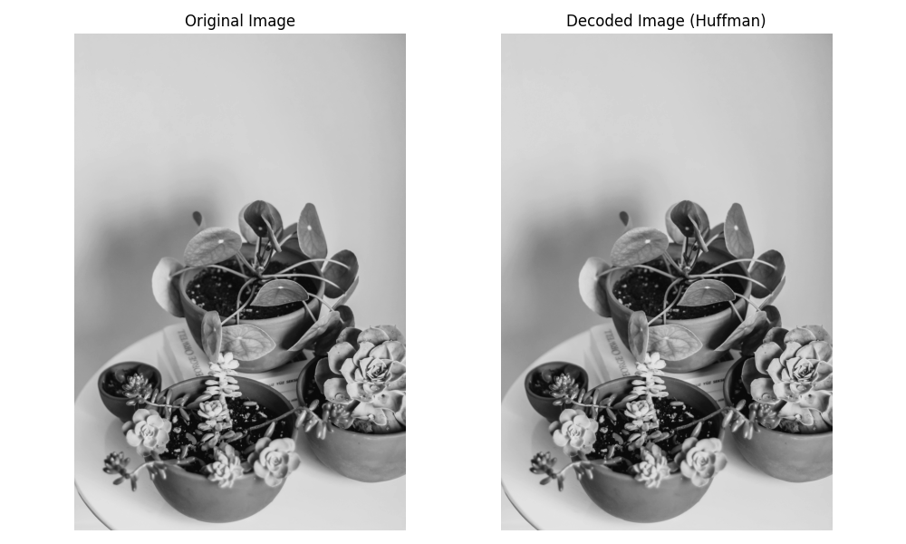

# 4. Huffman (Lossless)


##  What is Huffman Coding?

- Huffman coding is a variable-length, prefix-free coding algorithm used for lossless data compression. It reduces coding redundancy by assigning shorter codes to more frequent symbols.


##  Huffman Tree Construction Steps:

1. Count frequency of each symbol.
2. Create leaf nodes and insert into a priority queue.
3. While more than one node in the queue:
   - Remove two nodes with lowest frequency.
   - Combine them into a new node with frequency equal to sum.
   - Insert the new node into the queue.
4. Generate codes by traversing the tree.


##  Python Code 

```python

# Import required libraries
import cv2  # For image reading
import numpy as np  # For numerical operations
from collections import Counter  # For frequency counting
import heapq  # For priority queue used in Huffman coding
import matplotlib.pyplot as plt  # For displaying images

# Step 1: Read the grayscale image
path = 'sample.jpg'
img = cv2.imread(path, cv2.IMREAD_GRAYSCALE)
if img is None:
    raise FileNotFoundError(f"Image file not found at {path}")

# Step 2: Count frequency of each pixel value
freq = Counter(img.flatten())

# Step 3: Build a priority queue (min-heap) with frequency and symbols
heap = [[weight, [symbol, ""]] for symbol, weight in freq.items()]
heapq.heapify(heap)

# Step 4: Build the Huffman tree by combining nodes with lowest frequency
while len(heap) > 1:
    low = heapq.heappop(heap)
    high = heapq.heappop(heap)

    for pair in low[1:]:
        pair[1] = '0' + pair[1]  # Add '0' prefix for left branch
    for pair in high[1:]:
        pair[1] = '1' + pair[1]  # Add '1' prefix for right branch

    heapq.heappush(heap, [low[0] + high[0]] + low[1:] + high[1:])

# Step 5: Extract the final Huffman codes sorted by code length
huff_codes = sorted(heapq.heappop(heap)[1:], key=lambda p: (len(p[-1]), p))

# Create dictionaries for encoding and decoding
encode_dict = {symbol: code for symbol, code in huff_codes}
decode_dict = {code: symbol for symbol, code in huff_codes}

# Step 6: Encode the image pixels into Huffman bitstring
encoded_image = "".join(encode_dict[pixel] for pixel in img.flatten())

# Step 7: Decode the bitstring back to pixel values
decoded_pixels = []
code = ""
for bit in encoded_image:
    code += bit
    if code in decode_dict:
        decoded_pixels.append(decode_dict[code])
        code = ""

# Step 8: Convert decoded pixels to numpy array and reshape to original image shape
decoded_array = np.array(decoded_pixels, dtype=np.uint8).reshape(img.shape)

# Step 9: Display the original and decoded images side by side
fig, axes = plt.subplots(1, 2, figsize=(10, 6))

axes[0].imshow(img, cmap='gray')
axes[0].set_title('Original Image')
axes[0].axis('off')

axes[1].imshow(decoded_array, cmap='gray')
axes[1].set_title('Decoded Image (Huffman)')
axes[1].axis('off')

plt.tight_layout()
plt.show()

```

## MATLAB Code 

```matlab

% Read the grayscale image using MATLAB's imread
img = imread('sample.jpg');

% Convert to grayscale if not already
if size(img, 3) == 3
    img = rgb2gray(img);
end

% Step 1: Flatten the image into a 1D array for processing
img_vector = img(:);

% Step 2: Calculate frequency of each pixel intensity (0–255)
symbols = uint8(0:255);  % Possible grayscale values
counts = histcounts(double(img_vector), 0:256);  % Frequency count

% Keep only non-zero frequencies and corresponding symbols
nonzero_idx = counts > 0;
valid_symbols = symbols(nonzero_idx);
valid_counts = counts(nonzero_idx);

% Step 3: Create a Huffman dictionary using MATLAB's built-in function
dict = huffmandict(valid_symbols, valid_counts / sum(valid_counts));

% Step 4: Encode the image using the Huffman dictionary
encoded = huffmanenco(double(img_vector), dict);

% Step 5: Decode the image from Huffman encoded stream
decoded = huffmandeco(encoded, dict);

% Step 6: Reshape decoded vector back to original image dimensions
decoded_image = reshape(uint8(decoded), size(img));

% Step 7: Display original and decoded images side by side
figure;
subplot(1,2,1);
imshow(img);
title('Original Grayscale Image');

subplot(1,2,2);
imshow(decoded_image);
title('Decoded Image (Huffman)');


```




